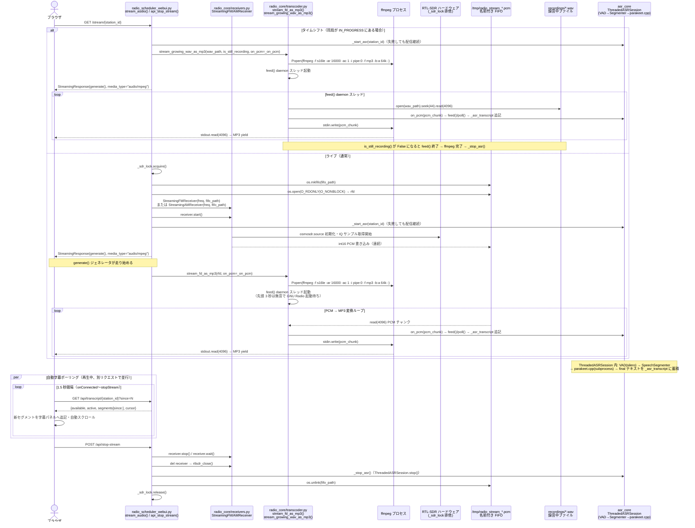

# radio_scheduler_webui.py — シーケンス図

## 配信フロー — シーケンス図

時系列での関数呼び出し順を示す。

### タイムシフト

- `stream_audio()` が `IN_PROGRESS_RECORDINGS` に同局を検出 → `stream_from_recording()` 経由で `stream_growing_wav_as_mp3()` を呼ぶ
- `feed()` daemon スレッドが WAV の 44 バイト目（PCM 本体）から 4096 B ずつ読んで ffmpeg stdin へ送り続ける
- `is_still_recording()` が `False` になった時点で `feed()` が終了 → ffmpeg が完了 → ストリーム終了

### ライブ

- `stream_audio()` が `_sdr_lock` を取得 → FIFO 作成 → `StreamingFMReceiver` / `StreamingAMReceiver` を生成・`.start()`
- GNU Radio（osmosdr）が RTL-SDR から IQ サンプルを取得し、復調・リサンプル後の int16 PCM を FIFO に書き込み続ける
- `stream_fd_as_mp3(rfd)` が ffmpeg を Popen し、`feed()` daemon スレッドが FIFO → ffmpeg stdin → MP3 → ブラウザへ yield する
- 先頭 3 秒は無音を ffmpeg stdin に流し、GNU Radio の起動遅延によるブラウザ側のバッファ枯渇を防ぐ

### 停止

- `POST /api/stop-stream` で `receiver.stop()/wait()` → `del receiver`（`rtlsdr_close()` 発火）→ `_stop_asr()` → FIFO 削除 → `_sdr_lock.release()`
- `generate()` の `finally`（タブ閉じ等）でも `_stop_asr()` を呼び、ASR セッションを確実に停止する

### 自動字幕（ASR）

- ライブ／タイムシフト両分岐で `_start_asr(station_id)` を呼び、`transcoder` に `on_pcm=_on_pcm` を渡す
- `feed()` が ffmpeg に送るのと同じ PCM チャンクを `_on_pcm` がタップ → `ThreadedASRSession.feed()`（背景 asyncio ループ上の `asr_core.StreamingASRService`）へ給餌し、`poll()` 結果を `_asr_transcript` に蓄積
- `asr_core` 内部: silero-vad → `SpeechSegmenter`（無音 700ms / 最大 18s で確定）→ parakeet.cpp（subprocess）→ final テキスト
- ブラウザは `onConnected` 後に `GET /api/transcript/{station_id}?since=N` を 1.5 秒間隔でポーリングし、新セグメントを下部の字幕パネルへ追記する（配信の MP3 ストリームとは別リクエスト）
- silero モデル / parakeet バイナリ未設置や依存欠如では `_start_asr` が握りつぶされ、**字幕は出ないが配信は正常**（graceful degradation、`ASR_ENABLED=0` で無効化可）
